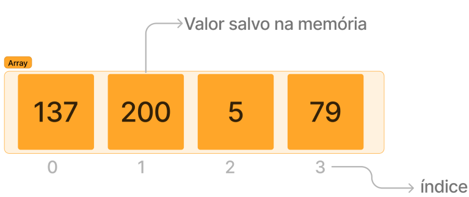
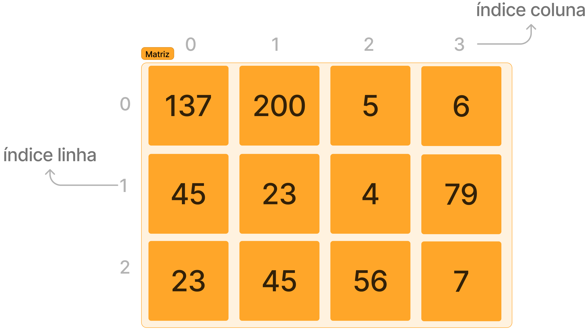
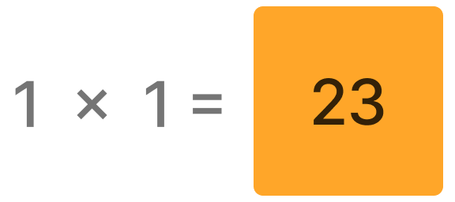

# Arrays
Os arrays representam uma das estruturas mais comuns, sendo utilizados para armazenar uma coleção ordenada de elementos. Cada elemento dentro de um array pode ser identificado por um índice específico.

Essa lista é considerada "ordenada", uma vez que todos os valores são acessados na mesma sequência, a menos que uma função seja criada para modificar esse comportamento. 
*Normalmente, nas linguagens de programação, os dados armazenados em arrays são do mesmo tipo, como strings, números ou objetos.*

Os arrays oferecem uma maneira eficiente de lidar com conjuntos de dados relacionados. Por exemplo, se quisermos armazenar imformações de usuários podemos usar um array para representar esses valores.

```python
pessoas = [
    Pessoa(nome="Alice", idade=25),
    Pessoa(nome="Bob", idade=30),
    Pessoa(nome="Charlie", idade=22)
]
```
### Matrizes
Também existem arrays que são multidimencionais chamados de matrizes, onde os dados se encontram organizados em linhas e colunas.


E é possivel acessar o dados expecifico passando as cordenadas de linha x coluna:

Essas estruturas são particularmente úteis em situações em que os dados têm uma relação bidimensional. Por exemplo, ao representar uma grade de pixels em uma imagem, podemos usar uma matriz para armazenar as intensidades de cor em cada posição.

```python
imagem = [
    [255, 120, 0],
    [0, 45, 200],
    [100, 50, 75]
]
```
Dessa forma, arrays e matrizes oferecem uma maneira eficaz de organizar e acessar dados, facilitando a manipulação e análise de conjuntos de informações relacionadas em programação.

---

## Exercicios:

##### 1 Encontrando Maior e Menor Valor em um Array
Desenvolva uma função que, dado um array de temperaturas que foram marcadas durante uma semana, encontre e retorne a maior e a menor temperatura presente no array.


##### Entrada:
```python
temperaturas = [25.5, 26.2, 24.8, 27.0, 23.5]

```

##### Saída:
```python
maior: 26.2
menor: 23.5
```


##### 2 Soma de Matrizes
Desenvolva uma função que, dado dois arrays bidimensionais (matrizes), realize a soma elemento a elemento dessas matrizes e retorne a matriz resultante.


##### Entrada:
```python
matrizA = [[1, 4, 0], [2, 5, 7], [3, 6, 9]]

matrizB = [[2, 3, 2], [5, 0, 1], [1, 3, 5]]
```

##### Saída:
```python
matrizC = [[3, 7, 2], [7, 5, 8], [4, 9, 14]]
```