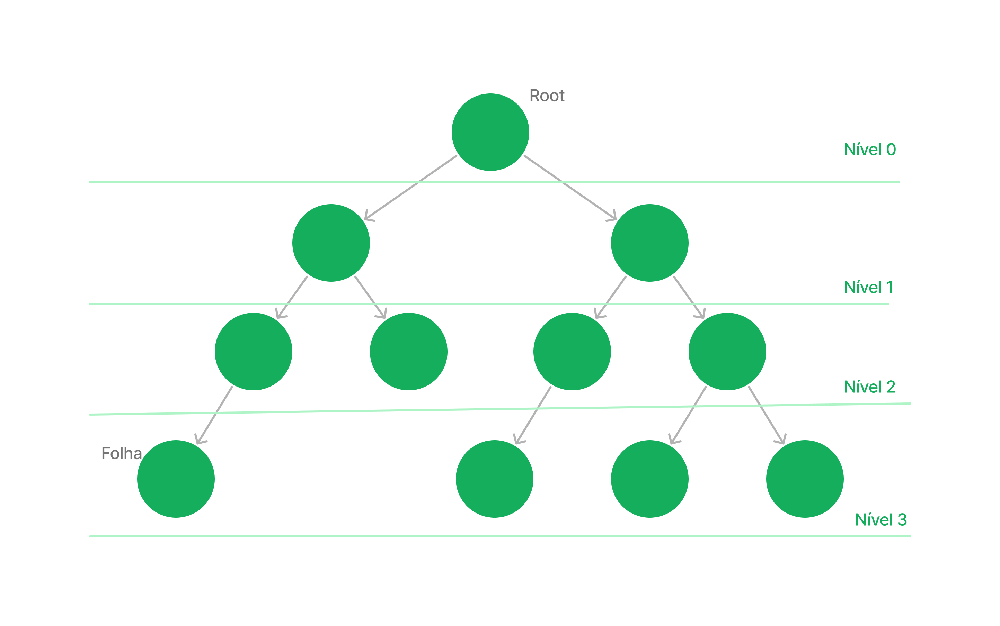

# Árvore
A estrutura árvores são usadas em estruturas de dados para organizar informações hierarquicamente. Uma analogia simples para compreender esse conceito é imaginar uma árvore genealogica onde existe um nó (root) central e seus decendentes.



A árvore é dividida em partes: 
- Raiz(root): É o ponto inicial da árvore, de onde todos os outros nós se originam.
- Nó: Representa um ponto individual na árvore e pode conter uma informação (valor).
- Galho:  É uma conexão entre dois nós, mostrando a relação entre eles.
- Folha: São os nós na ponta dos galhos que não têm outros nós conectados a eles.

 Um exemplo, de utilazação de uma árvore são os diretórios de um computador, a raiz seria a unidade de armazenamento, os galhos seriam pastas e as folhas seriam arquivos. Essa estrutura facilita a busca e organização eficientes de informações

Operações Comuns em árvores:
Quando trabalhamos com árvores existem algumas ações que podem sem realizada como

- Inserção e remoção de Nó: Adicionar ou remover um nó à árvore, respeitando as propriedades da árvore.
- Busca: Localizar um nó específico na árvore com base em um valor-chave.
- Percorrer a árvore: Percorrer todos os nós da árvore em uma ordem específica, como pré-ordem, em-ordem e pós-ordem.
- Altura da Árvore: Determinar a altura da árvore, que é a distância máxima entre a raiz e qualquer folha.


##### exemplo de árvore em python:
```python
class No:
    def __init__(self, chave):
        self.chave = chave
        self.esquerda = None
        self.direita = None

class ArvoreBinariaBusca:
    def __init__(self):
        self.raiz = None

    def inserir(self, chave):
        self.raiz = self._inserir(self.raiz, chave)

    def _inserir(self, raiz, chave):
        if raiz is None:
            return No(chave)
        
        if chave < raiz.chave:
            raiz.esquerda = self._inserir(raiz.esquerda, chave)
        elif chave > raiz.chave:
            raiz.direita = self._inserir(raiz.direita, chave)

        return raiz

    def buscar(self, chave):
        return self._buscar(self.raiz, chave)

    def _buscar(self, raiz, chave):
        if raiz is None or raiz.chave == chave:
            return raiz

        if chave < raiz.chave:
            return self._buscar(raiz.esquerda, chave)
        else:
            return self._buscar(raiz.direita, chave)

    def imprimir_em_ordem(self):
        self._imprimir_em_ordem(self.raiz)

    def _imprimir_em_ordem(self, raiz):
        if raiz:
            self._imprimir_em_ordem(raiz.esquerda)
            print(raiz.chave, end=" ")
            self._imprimir_em_ordem(raiz.direita)

# Exemplo de uso
arvore = ArvoreBinariaBusca()
valores = [10, 5, 15, 3, 7, 12, 20]

for valor in valores:
    arvore.inserir(valor)

arvore.imprimir_em_ordem()  # Saída esperada: 3 5 7 10 12 15 20

# Buscar um valor na árvore
resultado_busca = arvore.buscar(12)
if resultado_busca:
    print(f"\nO valor 12 foi encontrado na árvore.")
else:
    print(f"\nO valor 12 não foi encontrado na árvore.")


```

## Exemplos do Uso de árvores:

##### Sistema de Diretórios em Computadores::
Representação hierárquica de pastas e arquivos em um sistema de arquivos.

##### Árvores de Decisão em Algoritmos de Aprendizado de Máquina:
Estruturas utilizadas em algoritmos de aprendizado de máquina para tomar decisões com base em características dos dados.

---

## Exercicios:

##### 1 Mostre a quantidade de folhas na árvore
Com o modelo de árvore passado implemente um método para que recebe a raiz de uma árvore binária e retorna o número de folhas na árvore. Uma folha é um nó que não tem filhos (nem à esquerda, nem à direita).


<!-- \ ( °-° ) / -->