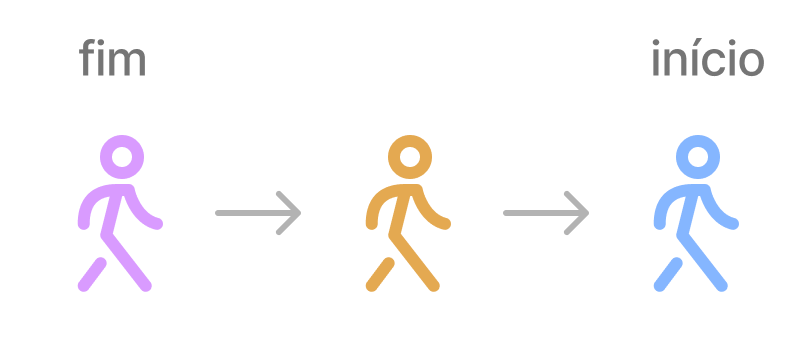

# Fila
A estrutura de Fila se assemelha a pilha, porém com uma mudança no princípio.

A fila segue o princípio de FIFO (First In, First Out), ou seja, primeiro a entrar, primeiro a sair. Uma analogia simples para compreender esse conceito é imaginar uma fila em um supermercado; quem entrou na fila antes é quem vai ser atendido primeiro, e os últimos sempre ficam no final da fila aguardando sua vez.



Operações Comuns em Filas:
Quando trabalhamos com filas existem algumas ações que podem sem realizada como

- Enqueue (Inserir na Fila): Adiciona um elemento ao final da fila.
- Dequeue (Remover da Fila): Remove o elemento do início da fila.
- Front: Retorna o elemento no início da fila sem removê-lo.
- IsEmpty: Verifica se a fila está vazia.


##### exemplo de fila em python:
```python
class Fila:
    def __init__(self):
        self.items = []

    def is_empty(self):
        return len(self.items) == 0

    def enqueue(self, item):
        self.items.append(item)

    def dequeue(self):
        if not self.is_empty():
            return self.items.pop(0)
        else:
            raise IndexError("A fila está vazia")

    def front(self):
        if not self.is_empty():
            return self.items[0]
        else:
            raise IndexError("A fila está vazia")

    def size(self):
        return len(self.items)


# Exemplo de uso da fila
fila_exemplo = Fila()

fila_exemplo.enqueue("A")
fila_exemplo.enqueue("B")
fila_exemplo.enqueue("C")

print("Frente da fila:", fila_exemplo.front())
print("Tamanho da fila:", fila_exemplo.size())

elemento_removido = fila_exemplo.dequeue()
print("Elemento removido:", elemento_removido)

print("Frente da fila após remoção:", fila_exemplo.front())
print("Tamanho da fila após remoção:", fila_exemplo.size())


```

## Exemplos do Uso de Filas:

##### Impressão de Documentos:
Em sistemas de impressão, onde as solicitações de impressão são tratadas em ordem de chegada.

##### Sistema de Resposta a Requisições:
Em servidores da web ou sistemas que processam requisições, uma fila pode ser usada para armazenar as requisições pendentes e processá-las na ordem em que foram recebidas.


---

## Exercicios:

##### 1 Mostre a a quantidade de elementos na fila
Com o modelo de fila passado implemente um método para contar e exibir a quantidade de elementos presentes na fila.


<!-- \ ( °-° ) / -->