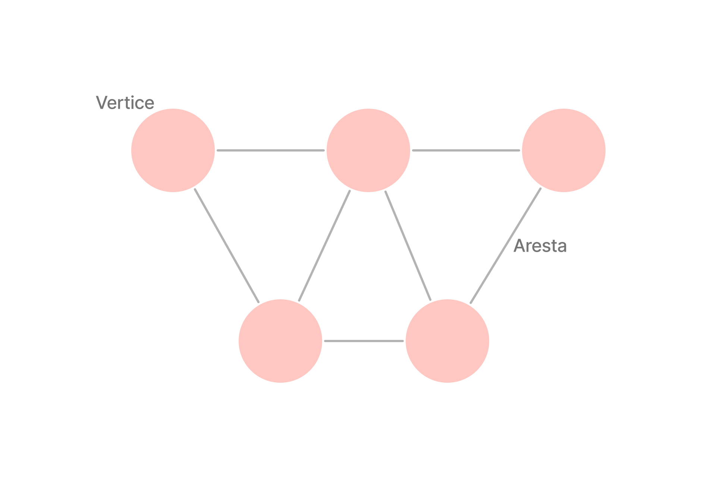

# Grafos

Grafos: Uma Introdução Simples

O que é um Grafo?

Um grafo é uma estrutura que representa um conjunto de objetos onde alguns pares desses objetos estão relacionados de alguma maneira. Esses objetos são chamados de "vértices" (ou nós), e as relações entre eles são chamadas de "arestas". Essa estrutura não é sequencial.



 Um exemplo, de utilazação de um grafo são as conexoes entre pessoas em redes socials, onde cada pessoa é um vertice e suas conexão com outra uma aresta. Outro exemplo poderia ser as rotas em um mapa, onde os vertices são pontos no mapa e as arestas caminhos que ligam esses pontos.

O grafo é dividido em partes: 
- Vertice (nó): Representam entidades distintas dentro do grafo. Por exemplo, em uma rede social, cada pessoa pode ser um vértice.

- Arestas:  São as conexões entre os vértices. Elas indicam a relação ou interação entre os elementos. No contexto de redes sociais, as arestas podem representar amizades.


##### exemplo de grafo em python:
```python
class Grafo:
    def __init__(self):
        self.grafo = {}

    def adicionar_vertice(self, vertice):
        if vertice not in self.grafo:
            self.grafo[vertice] = []

    def adicionar_aresta(self, vertice1, vertice2):
        self.adicionar_vertice(vertice1)
        self.adicionar_vertice(vertice2)

        # Adiciona as arestas nos dois sentidos, pois o grafo é não direcionado
        self.grafo[vertice1].append(vertice2)
        self.grafo[vertice2].append(vertice1)

    def imprimir_grafo(self):
        for vertice, vizinhos in self.grafo.items():
            print(f"{vertice}: {', '.join(map(str, vizinhos))}")

# Exemplo de uso
grafo_exemplo = Grafo()

grafo_exemplo.adicionar_aresta("A", "B")
grafo_exemplo.adicionar_aresta("B", "C")
grafo_exemplo.adicionar_aresta("B", "D")
grafo_exemplo.adicionar_aresta("C", "D")
grafo_exemplo.adicionar_aresta("D", "E")

grafo_exemplo.imprimir_grafo()

```

---

## Exercicios:

##### 1 Mostre o menor caminho
Com o modelo de grafo passado implemente um método para que recebe dois vertices e mostrar o menor caminho entre eles. 


<!-- \ ( °-° ) / -->