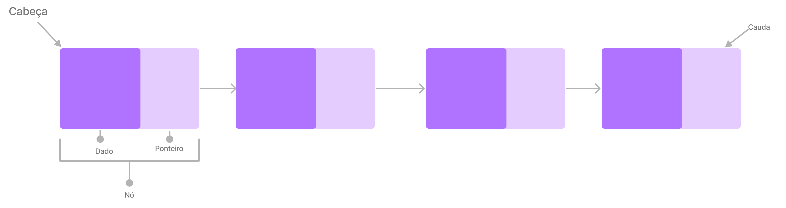

# Lista Ligada
Às vezes, quando queremos guardar informações na memória, pode ser complicado decidir desde o início quanto espaço cada informação ocupará. Se adicionarmos uma informação mais tarde e não houver lugar para ela, ela pode acabar longe das outras relacionadas, bagunçando nossa memória. Da mesma forma, se removermos uma informação, pode sobrar um buraco vazio na memória.
Para resolver isso, temos algo chamado lista ligada. Em vez de armazenar as informações de maneira contínua, a lista ligada usa ponteiros para conectá-las. Isso significa que as informações não ficam em sequência na memória, o que permite uma alocação mais flexível e eficiente, evitando espaços vazios ou fragmentação. Essa abordagem ajuda a organizar melhor a memória, se adaptando de forma mais flexível às mudanças na quantidade e tamanho das informações guardadas.




Uma lista ligada é uma coleção de nós, onde cada nó contém dados e um ponteiro para o próximo nó. 
Os nós em uma lista ligada não são armazenados sequencialmente na memória, mas a existência de ponteiros permite que sejam percorridos sequencialmente. Isso significa que, embora a disposição física dos nós na memória possa ser não contígua, a lógica da lista ligada, definida pelos ponteiros, permite uma navegação ordenada e eficiente de um nó para o próximo.

A lista ligada é dividaida em partes: 
- Nó: Um nó é a unidade básica de armazenamento em uma lista ligada. Ele contém os dados que queremos armazenar (por exemplo, um valor, uma informação) e um ponteiro para o próximo nó na sequência.
- Dado:  O dado é a informação armazenada no nó. Pode ser qualquer tipo de informação, dependendo do propósito da lista ligada. Por exemplo, em um álbum de fotos, o dado pode ser a imagem; em uma lista de reprodução de música, o dado pode ser o nome da música.
- Ponteiro: Um ponteiro é uma referência a outra posição na memória. No contexto de uma lista ligada, o ponteiro em um nó aponta para o próximo nó na sequência. Pode também apontar para null (ou None em Python) no caso do último nó, indicando o final da lista.
- Cabeça:  A cabeça é o primeiro nó da lista ligada. Representa o início da sequência de nós. A partir da cabeça, é possível percorrer toda a lista, indo de um nó para o próximo por meio dos ponteiros.
- Cauda:  A cauda é o último nó da lista ligada. O ponteiro na cauda geralmente aponta para null ou None, indicando o final da sequência.


Operações Comuns em Lista Ligada:
Quando trabalhamos com lista ligada existem algumas ações que podem sem realizada como

- Push (Inserção no Início): Adicionar um novo elemento no início da lista, criando um novo nó e ajustando os ponteiros.
- Append (Inserção no Final): Adicionar um novo elemento ao final da lista, criando um novo nó e ajustando os ponteiros.
- Inserção em uma Posição Específica: Adicionar um novo elemento em uma posição específica na lista, ajustando os ponteiros dos nós adjacentes.
- Buscar um Elemento: Percorrer a lista para encontrar um elemento específico com base no seu valor.
- Obter o Tamanho da Lista: Contar o número de elementos na lista.


##### exemplo de fila em python:
```python
class No:
    def __init__(self, dado=None, proximo=None):
        self.dado = dado
        self.proximo = proximo

class ListaLigada:
    def __init__(self):
        self.inicio = None

    def esta_vazia(self):
        return self.inicio is None

    def inserir_no_inicio(self, dado):
        novo_no = No(dado, self.inicio)
        self.inicio = novo_no

    def imprimir_lista(self):
        atual = self.inicio
        while atual:
            print(atual.dado, end=" -> ")
            atual = atual.proximo
        print("None")

# Exemplo de uso da lista ligada
lista = ListaLigada()

lista.inserir_no_inicio(3)
lista.inserir_no_inicio(7)
lista.inserir_no_inicio(1)

lista.imprimir_lista()

```

## Exemplos do Uso de Filas:

##### Playlist de música:
Implementação de listas de reprodução, onde cada faixa é um nó na lista, e a reprodução segue a ordem dos nós.

##### Slide Shows ou Apresentações de Slides:
A lista ligada permite a criação de apresentações de slides, onde as fotos são exibidas em sequência.


---

## Exercicios:

##### 1 Mostre a a quantidade de elementos na fila
Com o modelo de lista ligada passado implemente um método para buscar um elemento na lista, se o elemento existir deve retornar um true, se não retorne um false.

<!-- \ ( °-° ) / -->