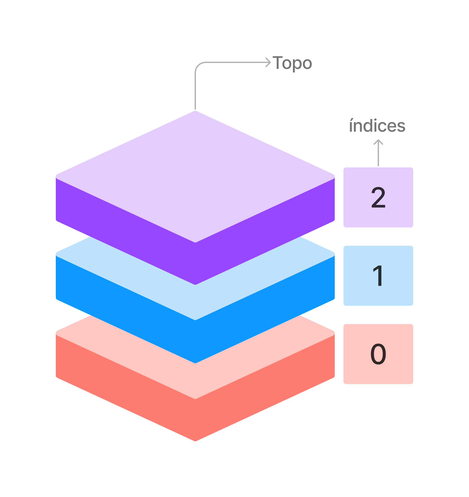

# Pilha
Em determinadas situações, é crucial manter a ordem em que as operações são realizadas ou acessar dados de maneira sequencial. Uma maneira eficaz de alcançar esse objetivo é por meio da utilização de uma estrutura de dados conhecida como pilha.

A pilha segue o princípio de LIFO (Last In, First Out), ou seja, o último elemento a ser inserido é o primeiro a ser removido. Uma analogia simples para compreender esse conceito é imaginar uma pilha física de livros. Para retirar um livro sem derrubar os demais, é necessário desempilhar os livros, retirando sempre o que está no topo. O último livro que foi colocado na pilha é o que está no topo e, portanto, é o primeiro a ser retirado.



Operações Comuns em Pilhas:
Quando trabalhamos com pilhas existem algumas ações que podem sem realizada como

- Push (Adicionar ao Topo): Adiciona um elemento ao topo da pilha.
- Pop (Remover do Topo): Remove o elemento do topo da pilha.
- Contar Elementos da Pilha: Retorna a quantidade de elementos presentes na pilha.


##### exemplo de pilha em python:
```python
class Pilha:
    def __init__(self):
        self.itens = []

    def is_vazia(self):
        return len(self.itens) == 0

    def push(self, item):
        self.itens.append(item)

    def pop(self):
        if not self.is_vazia():
            return self.itens.pop()
        else:
            raise IndexError("A pilha está vazia")

    def topo(self):
        if not self.is_vazia():
            return self.itens[-1]
        else:
            raise IndexError("A pilha está vazia")

# Exemplo de uso da pilha
pilha_exemplo = Pilha()

# Adicionando elementos à pilha
pilha_exemplo.push(10)
pilha_exemplo.push(20)
pilha_exemplo.push(30)

# Imprimindo o topo da pilha
print("Topo da Pilha:", pilha_exemplo.topo())

# Removendo elementos da pilha
print("Removido:", pilha_exemplo.pop())
print("Removido:", pilha_exemplo.pop())

# Verificando se a pilha está vazia
print("A pilha está vazia?", pilha_exemplo.is_vazia())

```

## Exemplos do Uso de Pilhas:

##### Navegação na Web:
Os navegadores de internet utilizam uma pilha para rastrear as páginas visitadas. Ao pressionar o botão "voltar", a última página visitada é retirada da pilha.

##### Undo em Editores de Texto:
Em editores de texto, a funcionalidade "ctrl+Z" (undo) é frequentemente implementada usando uma pilha. Cada ação de edição é empilhada, permitindo desfazer as alterações na ordem inversa.


Ao utilizar pilhas, é possível garantir uma organização ordenada de dados, o que é essencial em muitos contextos do dia a dia e da programação.

---

## Exercicios:

##### 1 Mostre a a quantidade de elementos na pilha
Com o modelo de pilha passado implemente um método para contar e exibir a quantidade de elementos presentes na pilha.


<!-- \ ( °-° ) / -->